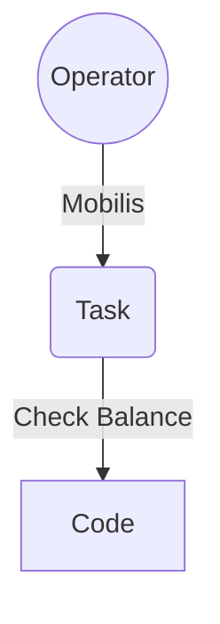

___
```
  ____ _____
 |  _ \__  /
 | | | |/ / 
 | |_| / /_ 
 |____/____|
```

# ToDo
ToDo Web Application

[ToDo](https://haithamaouati.github.io/ToDo)
## Table of Contents
- [Demo](#demo)
- [Author](#author)
- [License](#license)

## Demo
Version: **1.0**
[https://haithamaouati.github.io/ToDo](https://haithamaouati.github.io/ToDo)

**Flowchart**



## Author
Made with :heart: by **Haitham Aouati**

## License
This repository is under [Unlicense License](https://github.com/haithamaouati/ToDo/blob/main/LICENSE).

([Table of Contents](#table-of-contents))


